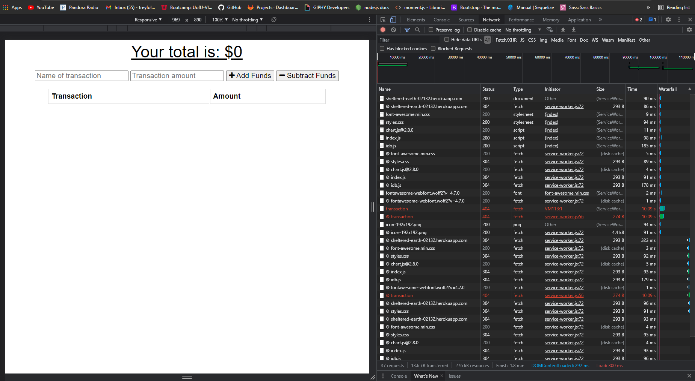
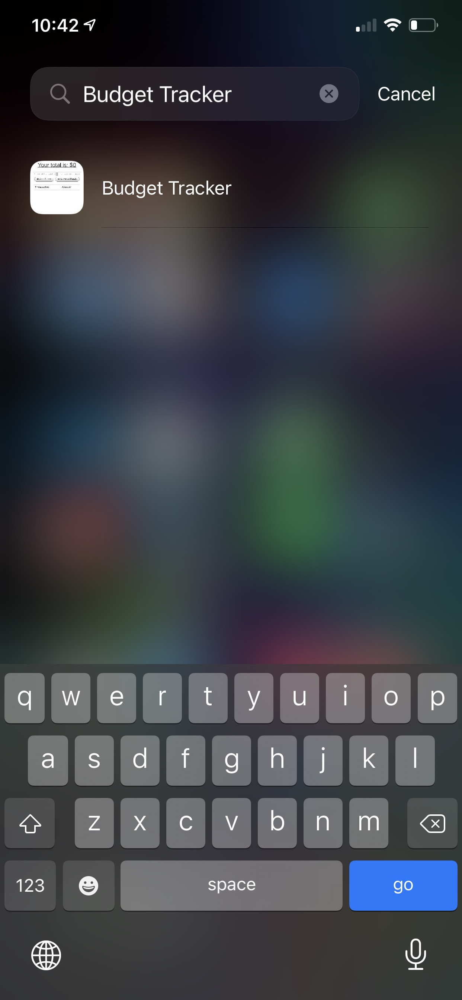
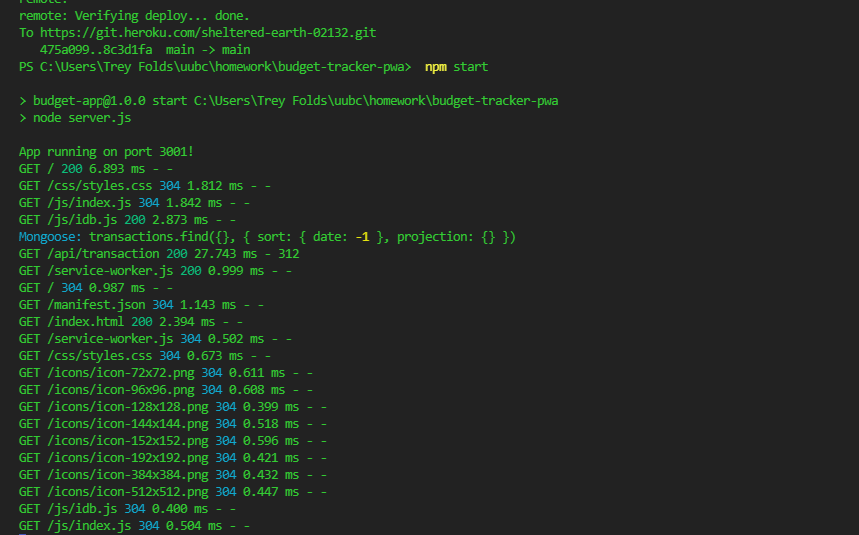
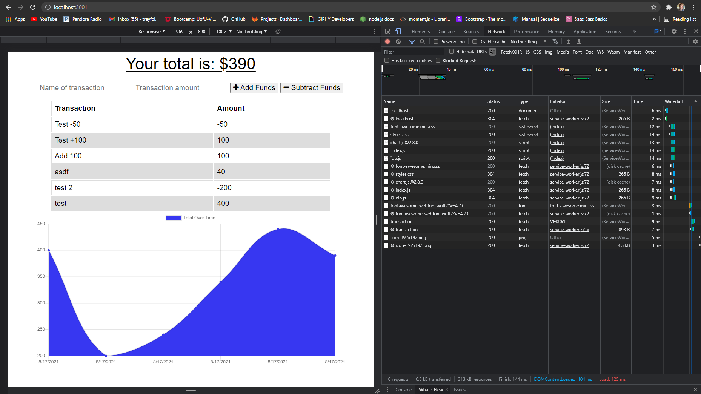

# Budget Tracker 

  ## About/Description

  This project is a budget tracker app.  As users will need to be able to add transactions no matter the their internet connection.  In order to meet this user need, this application is setup as a PWA so users can access this from their phone or computer.  Users can add an icon to their home screen. It also utilizes IndexDB to store transactions if the user is offline and adds those transactions when the user re-connects to the internet. This application is loaded to Heroku though Iv tried everything and cant seem to fix the heroku deployment though everything else should be in good working order.

  ## Table of Contents

  * [Installation](#installation)
  * [Usage](#usage)
  * [Languages](#languages)
  * [Contributing](#contributing)
  * [License](#license)
  * [Tests](#tests)
  * [Questions](#questions)
  
  ## Installation

  This application is loaded to Heroku though Iv tried everything and cant seem to fix the heroku deployment though everything else should be in good working order.  Users can open this application from their phone and add it using an icon to their screen with the Add to Home Screen.

  Live Link: https://sheltered-earth-02132.herokuapp.com/

  ## Usage

  ### Screenshots

  #### Transactions for the budget tracker

  

  #### Fail to connect to server 404 error and I don't know why

  

  #### Able to add to your homescreen as a pwa for offline use

  

  #### Deployment of heroku and local host

  

  #### Local host works great

  

  ## Languages

  JavaScript HTML CSS IndexDB Service Worker Mongoose

  ## Contributing

  Contributions by: Mack Folds

  If you would like to contribute to this project we follow the [Contributor Covenant](https://www.contributor-covenant.org/)

  ## License

  https://choosealicense.com/licenses/mit/

  ## Tests

  ## Questions:

  If you have any questions please contact us or refer to our github below:

  Email Us At: mackfoldsiii@gmail.com

  Github Repo: https://github.com/mackfolds/budget-tracker-pwa